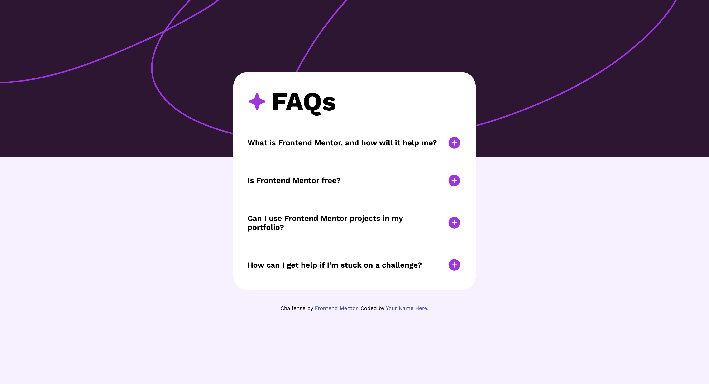
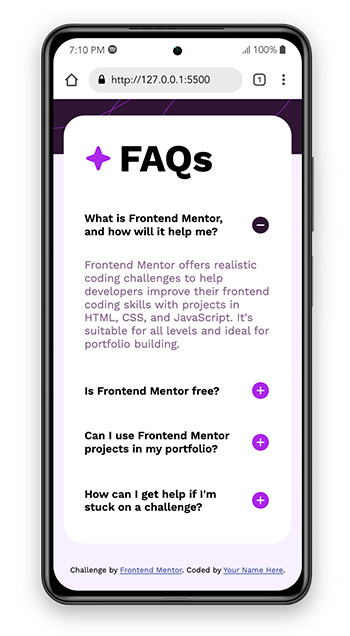

# Frontend Mentor - FAQ accordion solution

This is a solution to the [FAQ accordion challenge on Frontend Mentor](https://www.frontendmentor.io/challenges/faq-accordion-wyfFdeBwBz). Frontend Mentor challenges help you improve your coding skills by building realistic projects.

## Table of contents

- [Overview](#overview)
  - [The challenge](#the-challenge)
  - [Screenshot](#screenshot)
  - [Links](#links)
- [My process](#my-process)
  - [Built with](#built-with)
  - [What I learned](#what-i-learned)
  - [Continued development](#continued-development)
  - [Useful resources](#useful-resources)
- [Author](#author)

**Note: Delete this note and update the table of contents based on what sections you keep.**

## Overview

### The challenge

Users should be able to:

- Hide/Show the answer to a question when the question is clicked
- Navigate the questions and hide/show answers using keyboard navigation alone
- View the optimal layout for the interface depending on their device's screen size
- See hover and focus states for all interactive elements on the page

### Screenshot

### Links

- Solution URL: [Solution](https://github.com/ctspecht12/FM-FAQ-Accordion)
- Live Site URL: [Live Site](https://ctspecht12.github.io/FM-FAQ-Accordion/)

## My process

### Built with

- Visual Studio Code

### What I learned

This is the first project I've done that included javascript. I learned a lot about javascript functions and also learned that I have a lot to learn. I'm comfortable with HTML and CSS, but javascript really throws me for a loop.

### Continued development

I intend to continue practicing doing projects with javascript because that's where I really need to improve my literacy.

### Useful resources

- [Creating an Accordion | HTML, CSS, JavaScript | Tutorial](https://www.youtube.com/watch?v=4w2bcqb25VQ&t=4s) by [@heyitzami442](https://www.youtube.com/@heyitzami442)- This video was incredibly helpful in teaching me the basics of creating an accordion using js. It didn't translate exactly to this project, but got me very close to a solution.

-Github/VSC Copilot—I was able to get very close to a solution using the tutorial above, but couldn't figure out how to incorporate triggering the icon to switch. After about 2 hours of attempts, I finally asked Copilot what the best solution would be and why. It helped me understand it a bit better and offered me the best solution.

## Author

- Frontend Mentor - [@ctspecht12](https://www.frontendmentor.io/profile/ctspecht12)
